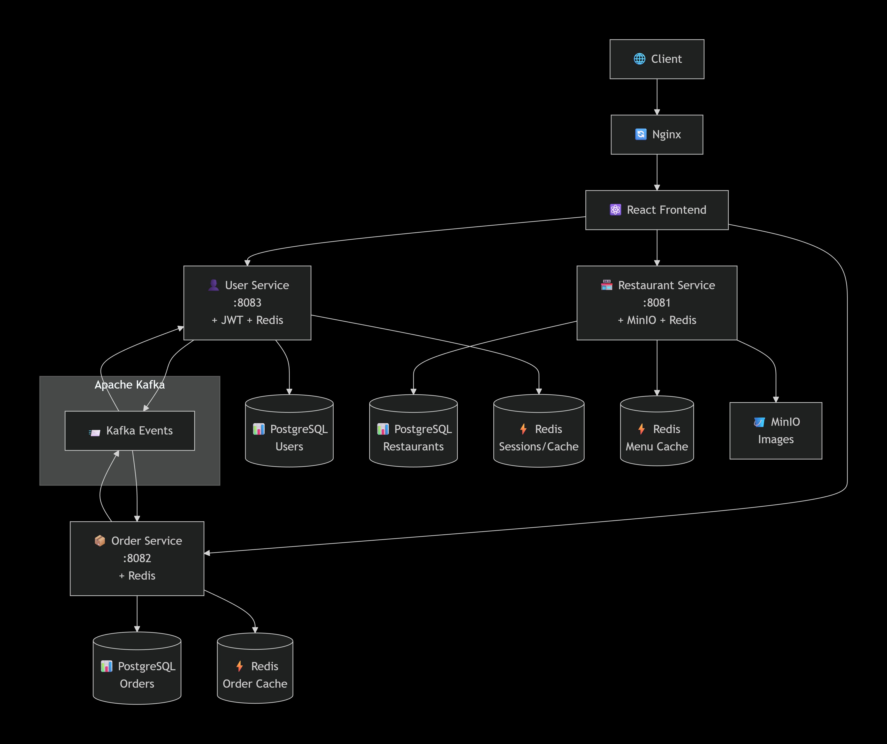
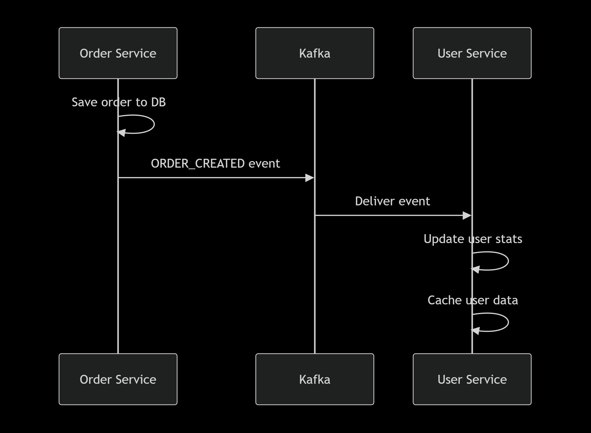

# 🍔🚚 Food Delivery Platform

<div align="center">


**Microservice Food Delivery Platform with Async User ↔ Order Communication**

[Quick Start](#-quick-start) • [Architecture](#-architecture) • [API Docs](#-api-documentation)

</div>

## ✨ Features

| Service | Technologies | Description |
|---------|-------------|-------------|
| 🏪 **Restaurant Service** | Spring Boot, MinIO, Redis | Restaurant catalog, menus, image storage |
| 🛒 **Order Service** | Spring Boot, Kafka, Redis | Order management with async events |
| 👤 **User Service** | Spring Boot, JWT, Kafka | Authentication & user profiles |
| ⚡ **Caching** | Redis | High-performance distributed cache |
| 📨 **Event Streaming** | Apache Kafka | Async communication between services |
| 🗄️ **File Storage** | MinIO | S3-compatible image storage |

## 🏗 Architecture

<div align="center">
  
</div>

### Components:
- **User Service (8081)** - Authentication, JWT tokens, user profiles
- **Order Service (8083)** - Order processing, payments, history
- **Restaurant Service (8082)** - Restaurant catalog, menus, images
- **React Frontend (5173)** - Modern user interface
- **Kafka** - Async event streaming (User ↔ Order only)
- **Redis** - Distributed caching per service
- **PostgreSQL** - Relational databases
- **MinIO** - Object storage for images
- **Nginx** - Reverse proxy & load balancer

## 📨 Event-Driven Architecture

### Kafka Topics:
- **`user.events`** → User events (consumed by Order Service)
- **`order.events`** → Order events (consumed by User Service)

# 🚀 Quick Start

## Prerequisites:
- Docker 20.10+ and Docker Compose 2.0+
- Git

## Deployment in 3 Steps:

1. Clone the repository
git clone https://github.com/your-username/foodflow.git
cd foodflow

2. Configure environment
cp .env.example .env
Edit .env file with your configuration

3. Start all services
docker-compose up -d
\```

## Access Services After Deployment:

| Service | URL | Description |
|---------|-----|-------------|
| 🌐 Frontend Application | http://localhost | Main customer interface |
| 📚 User Service API | http://localhost/api/users | User management API |
| 🏪 Restaurant Service API | http://localhost/api/restaurants | Restaurant management API |
| 📦 Order Service API | http://localhost/api/orders | Order processing API |
| 📖 User Service Swagger | http://localhost:8081/swagger-ui.html | User API documentation |
| 📖 Restaurant Service Swagger | http://localhost:8082/swagger-ui.html | Restaurant API documentation |
| 📖 Order Service Swagger | http://localhost:8083/swagger-ui.html | Order API documentation |
| 📷 MinIO Console | http://localhost:9090 | Object storage management |
| 📊 Nginx Status | http://localhost/nginx_status | Reverse proxy metrics |

## 🗂️ Project Structure

```
foodflow/
├── .github/workflows/        # GitHub Actions CI/CD pipelines
├── delivery-ui/              # Frontend React application
├── foodDeliveryPlatformUser/ # User Service (Spring Boot)
├── foodDeliveryPlatformRestaurant/ # Restaurant Service
├── foodDeliveryPlatformOrder/ # Order Service
├── nginx/                    # Nginx configuration
├── scripts/                  # Deployment and utility scripts
├── docker-compose.yml        # Docker Compose configuration
├── .env.example             # Environment variables template
├── LICENSE                  # Project license
└── README.md               # This documentation
```

## 🔧 Development Setup

### Local Development:

Start only specific services
docker-compose up -d postgres redis minio

Build and run individual services
cd foodDeliveryPlatformUser
./mvnw spring-boot:run

Frontend development
cd delivery-ui
npm install
npm run dev

## 🔄 Event Flow Examples
User Registration Event

<div align="center">
  
</div>

Order Creation Event

<div align="center">
  
</div>

## 📊 API Documentation

Each service provides comprehensive OpenAPI 3 documentation:

- Interactive Swagger UI available at service-specific endpoints
- OpenAPI JSON specification at `/v3/api-docs`
- Postman collection included in `/docs` directory

## 🛡️ Security Features

✅ JWT-based authentication with refresh tokens  
✅ Role-based access control (RBAC)  
✅ Password encryption with BCrypt  
✅ CORS configuration for secure cross-origin requests  
✅ Input validation and sanitization  
✅ SQL injection prevention  
✅ XSS protection headers

## 📈 Scalability & Performance

🚀 Microservices architecture for independent scaling  
⚡ Redis caching for frequently accessed data  
📊 Connection pooling for database efficiency  
🔄 Asynchronous processing with Kafka  
🗂️ Horizontal scaling support for each service  
📦 Containerized deployment with Docker

## 🤝 Contributing

We welcome contributions! Please see our Contributing Guidelines for details.

1. Fork the repository
2. Create a feature branch (`git checkout -b feature/AmazingFeature`)
3. Commit your changes (`git commit -m 'Add some AmazingFeature'`)
4. Push to the branch (`git push origin feature/AmazingFeature`)
5. Open a Pull Request

## 🙏 Acknowledgments

- Spring Boot team for the excellent framework
- React community for amazing frontend tools
- Docker for containerization technology
- All open-source contributors whose work made this project possible

## 📞 Support

For support, email savostukaleksei@gmail.com or open an issue in the GitHub repository.

⭐ Star us on GitHub if you find this project useful!

## 🍽️ Happy ordering!
